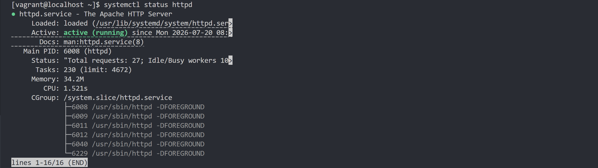
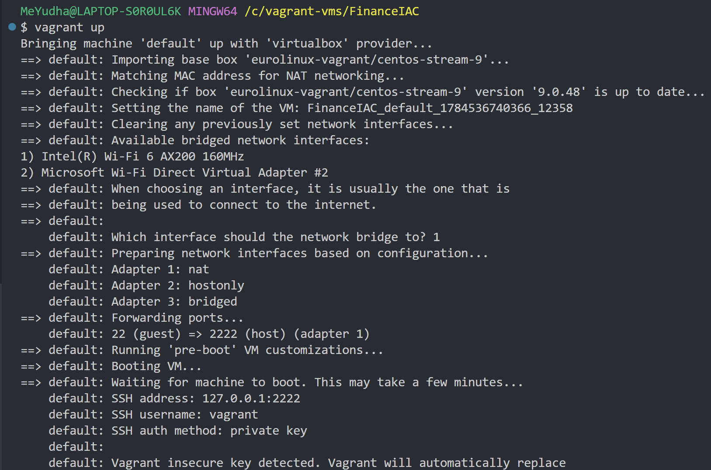

# Vagrant Apache Web Deployment

## 📌 Overview

This project demonstrates the implementation of Infrastructure as Code (IaC) using Vagrant to automatically provision a CentOS Stream 9 virtual machine. During provisioning, Apache HTTP Server (httpd) is installed, configured, and used to deploy a responsive website template automatically.

The project aims to simplify web server deployment by automating the entire setup process with a single command.

---

## 🚀 Features

- Automated virtual machine provisioning using Vagrant
- Apache HTTP Server (httpd) installation and configuration
- Automated website deployment
- Private network configuration
- Shell script provisioning
- One-command deployment (`vagrant up`)

---

## 🛠 Technologies Used

- Vagrant
- VirtualBox
- CentOS Stream 9
- Apache HTTP Server (httpd)
- Bash

---

## 📂 Project Structure

```
.
├── Vagrantfile
├── README.md
├── LICENSE
└── screenshots
    ├── website.png
    ├── apache-status.png
    └── vagrant-up.png
```

---

## ▶️ Getting Started

### Prerequisites

- Vagrant
- VirtualBox

### Clone the Repository

```bash
git clone https://github.com/yudhaafrizarevi/vagrant-apache-web-deployment.git
cd vagrant-apache-web-deployment
```

### Start the Virtual Machine

```bash
vagrant up
```

### Access the Website

Open your browser and visit:

```
http://192.168.56.23
```

---

## 📸 Screenshots

### Website


### Apache HTTP Server Status



### Vagrant Provisioning




---

## 📄 License

This project is licensed under the MIT License.
